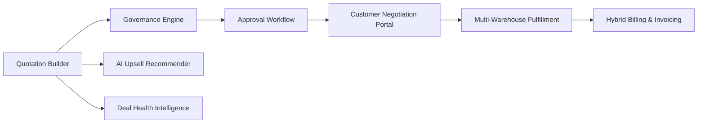

# DealFlow360 🚀
### *An Intelligent, Self-Governing B2B Sales Operations Platform*

[](https://www.typescriptlang.org/)
[](https://reactjs.org/)
[](https://vitejs.dev/)
[](https://www.prisma.io/)
[](https://www.sqlite.org/)
[](https://tailwindcss.com/)

---

## 📌 What is DealFlow360?

Most sales platforms act as dumb data entry forms: you draft a quote, manually email managers for discount approval, phone the warehouse to see if stock exists, and juggle separate billing systems for subscriptions vs hardware.

**DealFlow360** eliminates this sales chaos by connecting the entire B2B sales lifecycle into a **single, self-governing, reactive workflow**:

```
[ Quote Creation ] ──► [ AI Upsell Engine ] ──► [ Discount Governance & Risk ]
        ▲                                                      │
        │ Re-approval                                          ▼
[ Customer Negotiation ] ◄────────────────────────── [ Multi-tier Approval ]
        │
        ▼
[ Multi-Warehouse Fulfillment ] ──► [ Hybrid Billing & Invoicing ] ──► [ Deal Health & AI Alerts ]
```

When something changes in one stage of a deal (e.g. a customer requests a 20% discount in the portal, or a warehouse runs out of stock), the platform **automatically recalculates risk, routes approvals, splits fulfillment orders, and alerts stakeholders** in real time.

---

## ⚡ Quick Start & How to Access

### 1. Prerequisites
* **Node.js** 18+ installed
* **npm** 9+ installed

### 2. Installation & Database Setup
```bash
# Clone the repository
git clone https://github.com/yashsai786/DealFlow360-odoo.git
cd DealFlow360-odoo

# Install dependencies
npm install

# Seed the enterprise database (300+ quotations, 215 products, 52 users, 5 warehouses)
npx tsx prisma/seed.ts

# Start the development server
npm run dev
```

### 3. Accessing the Application
Open your browser and navigate to:
👉 **`http://localhost:5173`**

---

## 👥 Demo Personas (1-Click Instant Sign-In)

The login screen includes **1-click quick login buttons** for every key enterprise role. You can also log in manually with password `DealFlow@2026`:

| Persona | Role | Email | Best For Testing |
| :--- | :--- | :--- | :--- |
| **Sasha Idris** | **Admin** | `admin@dealflow360.io` | Setting governance rules, discount ceilings & audit logs |
| **Dana Whitfield** | **Sales Manager** | `manager@dealflow360.io` | Reviewing discount escalations, approving/rejecting deals |
| **Owen Vasquez** | **Finance & Ops** | `finance@dealflow360.io` | High-risk deal sign-off, margin audits & payment ledger |
| **Priya Raman** | **Sales Rep** | `rep@dealflow360.io` | Creating quotes, live AI recommendations, deal intelligence |
| **Lena Ortiz** | **Customer Portal** | `acme@customer.io` | Negotiating live quotes, requesting concessions, accepting orders |

> 💡 **Self-Service Customer Onboarding**: In the **Sign Up** tab, selecting **Customer** gives you the choice to either join an existing enterprise account or click **`+ New Company`** to register a brand-new organization on the fly!

---

## 💡 Key Problems & Unique Solutions

| The Real-World Sales Problem | How DealFlow360 Uniquely Solves It |
| :--- | :--- |
| **Rogue Discounting & Margin Erosion**<br>Reps give unapproved discounts to close deals, hurting profitability. | **Self-Governing Discount Governance Engine**<br>Evaluates customer tiers (Gold 15%, Silver 10%, Bronze 5%) and category margins in real-time. Automatically scores deal risk and locks quotes into hierarchical approval chains (Sales Manager $\rightarrow$ Finance) before issuance. |
| **Fragmented Multi-Warehouse Stock**<br>Orders get stuck because products are scattered across regional hubs. | **Intelligent Multi-Warehouse Fulfillment Splitting**<br>Simulates live inventory across 5 hubs (Mumbai, Kolkata, Delhi, Bengaluru, Ahmedabad), calculates freight costs, automatically splits shipment allocations, and generates backorders for replenishment. |
| **Complex Hybrid Billing**<br>Mixing one-time hardware with recurring subscriptions breaks traditional invoicing. | **Unified Hybrid Billing with Mid-Cycle Proration**<br>Quotes combine one-time capital purchases and monthly/quarterly subscriptions on one screen. Handles automated billing calendars, proration refunds, and payment reconciliation. |
| **Disconnected Customer Negotiations**<br>Price haggling happens over messy email chains with no accountability. | **External Customer Negotiation Portal**<br>Customers review live interactive quotes, propose line-item counter-discounts or requested dates, and chat directly with reps. If a concession violates policy, the platform auto-triggers re-approval. |
| **Silent Deal Deaths (Stalled Pipeline)**<br>Deals sit idle for weeks without anyone noticing. | **Proactive Deal Health & Anomaly Detector**<br>Monitors deal velocity, discount anomalies, delivery slippage, and stalled negotiation cycles. Gives reps 1-click **Nudge** and **Escalate** actions. |
| **Rigid Pre-seeded Mock Constraints**<br>Demo platforms only allow logging into pre-baked customer accounts. | **On-the-Fly Corporate Registration**<br>Prospective customers can either select an existing account (to test quotes with historical data) or provision a new corporate entity with industry and tier on the fly. |

---

## 🏗️ Architecture & Tech Stack

DealFlow360 is built using **Domain-Driven Design (DDD)** with clean separation between the presentation layer, application services, domain business rules, and persistent storage:

```
[ Frontend: React 18 + Tailwind CSS + Radix UI / shadcn ]
                       │ (REST / API Bridge)
[ Application Layer: Next.js API Routes & Service Contracts ]
                       │
[ Domain Services: Governance, Recommendations, Fulfillment, Billing, Intelligence ]
                       │
[ Infrastructure Layer: Prisma ORM + SQLite Persistent Engine ]
```

* **Frontend**: React 18, TypeScript, Tailwind CSS, Radix UI (shadcn/ui), Lucide Icons
* **Backend**: Next.js App Router API routes bridged seamlessly into Vite dev server
* **Persistence**: Prisma ORM with SQLite database (`prisma/dev.db`)
* **State Management**: Reactive in-memory store with LocalStorage hydration and database synchronization
* **Enterprise Dataset**: 52 Users, 30 Customers, 215 Products, 5 Warehouses, 390 Inventory Items, 300 Quotations (250 completed history + 50 active pipeline), 275 Approvals, 250 Fulfillment Orders, and 125 Invoices.

---

## 📐 Architecture & Data Model

For the complete one-page architecture diagram, service connectivity layout, and Entity-Relationship (ERD) schema, see:
👉 **[ARCHITECTURE.md](./ARCHITECTURE.md)**



---

## 🧪 5-Minute Demo Flow to Showcase

1. **Sign in as Sales Rep** (`rep@dealflow360.io`):
   * Open **Quotation Builder**, select **Acme Corp** (Gold Tier, max 15% discount).
   * Add **Setup Service** at an **18% discount** (exceeds service ceiling).
   * Notice the **AI Recommendation banner** suggest a complementary Care Pack.
   * Click **Submit for Approval** $\rightarrow$ System scores deal as **High Risk** and locks it into multi-tier approval.
2. **Switch to Sales Manager** (`manager@dealflow360.io`):
   * Go to **Approvals Queue** $\rightarrow$ Review quote risk breakdown and click **Approve**.
3. **Switch to Customer Portal** (`acme@customer.io`):
   * View the newly approved quote in the Customer Portal.
   * Request a concession or revision in the negotiation drawer.
4. **Inspect Fulfillment & Hybrid Billing**:
   * Confirm the deal $\rightarrow$ View automated **warehouse split allocation** across regional depots.
   * View the generated **hybrid invoice** with both one-time hardware lines and recurring subscription schedules.

---

## 🔮 What the Team Would Build Next (With More Time)

* **ERP & Accounting Webhook Integrations**: Two-way synchronization with Odoo Enterprise, SAP, and NetSuite for general ledger sync and real-time physical warehouse count updates.
* **AI-Powered Dynamic Pricing & Elasticity Modeling**: Machine learning models predicting the optimal discount percentage to maximize win probability while preserving gross margin.
* **Automated Document Generation**: Instant generation of binding Master Services Agreements (MSAs) and Statements of Work (SOWs) with digital signature workflows.
* **Self-Service Multi-Tenant RBAC**: Custom organization onboarding, configurable SSO (SAML 2.0 / Okta), and user-defined approval escalation matrices.

---

## 📄 License
Developed for the **DealFlow360 Hackathon**. All rights reserved.
